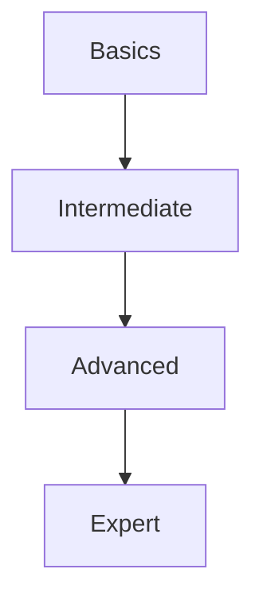
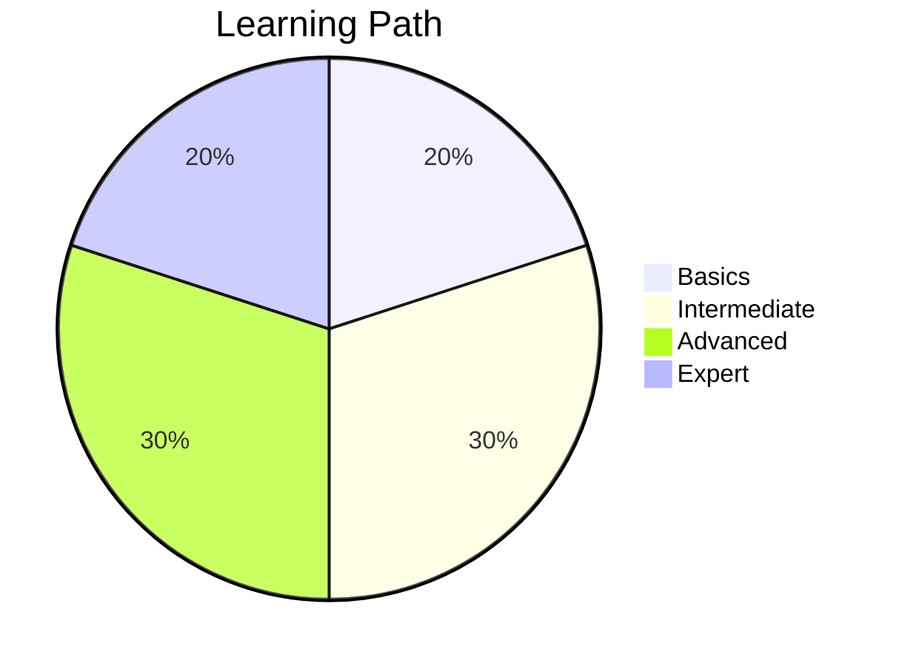

# 🚀 Kotlin Coroutines Learning Path

Welcome to your journey through Kotlin Coroutines! This guide will take you from the very basics to advanced concepts, ensuring you have a solid foundation before moving forward.



## 📚 Table of Contents
1. [🛠️ Prerequisites](#-prerequisites)
2. [🔰 Beginner Level](#-beginner-level)
3. [📈 Intermediate Level](#-intermediate-level)
4. 🚀 Advanced Level
5. 🏆 Expert Level

## 🛠️ Prerequisites
- Basic Kotlin syntax
- Understanding of functions and lambdas
- Familiarity with collections and higher-order functions

## 🔰 Beginner Level

### 1. Introduction to Coroutines
   - What are coroutines?
   - Why use coroutines?
   - Coroutines vs Threads
   - Suspending functions

### 2. First Coroutine
   - `launch` builder
   - `runBlocking`
   - `delay()` vs `Thread.sleep()`
   - CoroutineScope

### 3. Coroutine Builders
   - `launch` vs `async`
   - `withContext`
   - `coroutineScope` builder

### 4. Cancellation & Timeouts
   - Cancelling coroutines
   - Timeout handling
   - Cooperative cancellation

```kotlin
// Example: Basic coroutine
fun main() = runBlocking {
    launch {
        delay(1000L)
        println("Hello from coroutine!")
    }
    println("Hello from main thread")
}
```

## 📈 Intermediate Level

### 1. Coroutine Context & Dispatchers
   - Dispatchers (Main, IO, Default, Unconfined)
   - Switching contexts
   - Thread confinement

### 2. Exception Handling
   - try/catch in coroutines
   - CoroutineExceptionHandler
   - SupervisorJob
   - SupervisorScope

### 3. Flows
   - Introduction to Flows
   - Cold vs Hot streams
   - Operators (map, filter, transform)
   - Flow context and thread management

### 4. Channels
   - Basic channel operations
   - Channel types (Rendezvous, Buffered, Conflated)
   - Producers and actors

```kotlin
// Example: Flow
fun simple(): Flow<Int> = flow {
    for (i in 1..3) {
        delay(100)
        emit(i)
    }
}
```

## 🚀 Advanced Level

### 1. StateFlow & SharedFlow
   - State management
   - StateFlow vs LiveData
   - SharedFlow configuration
   - StateFlow vs SharedFlow

### 2. Coroutine Testing
   - Testing suspending functions
   - Test dispatchers
   - Time control in tests

### 3. Coroutine Patterns
   - Structured concurrency
   - Error handling patterns
   - Resource management

### 4. Performance Optimization
   - Coroutine performance characteristics
   - Memory management
   - Profiling coroutines

## 🏆 Expert Level

### 1. Deep Dive into Coroutine Internals
   - Continuation Passing Style (CPS)
   - Coroutine state machine
   - Bytecode analysis

### 2. Custom Coroutine Context
   - Creating custom dispatchers
   - Thread-local data
   - Coroutine context inheritance

### 3. Advanced Flow Operations
   - Custom flow operators
   - Flow error handling strategies
   - Flow testing

### 4. Coroutines in Multiplatform
   - Cross-platform coroutines
   - Native and JS targets
   - Platform-specific implementations

## 📚 Additional Resources
- [Kotlin Coroutines Guide](https://kotlinlang.org/docs/coroutines-guide.html)
- [Kotlin Coroutines by Example](https://play.kotlinlang.org/hands-on/Introduction%20to%20Coroutines%20and%20Channels/)
- [Kotlin Coroutines in Practice - YouTube](https://www.youtube.com/watch?v=a3agLJQ6vt8)

## 🔄 Practice Projects
1. Build a weather app using coroutines for API calls
2. Create a file downloader with progress updates
3. Implement a chat application using Flows
4. Build a stock market data stream processor

## 🎯 Next Steps
1. Start with the beginner concepts
2. Practice each concept with small examples
3. Build small projects to reinforce learning
4. Join Kotlin communities for help and discussions

Happy coding! 🚀



> 💡 Remember: Mastery comes with practice. Build real projects to solidify your understanding!

---

<div align="center">
  <h3>✨ Guide Created By ✨</h3>
  <a href="https://github.com/A-U-7">
    
  </a>
  
  [](https://github.com/A-U-7)
  
  <p>If you found this guide helpful, consider giving it a ⭐ on GitHub!</p>
</div>
